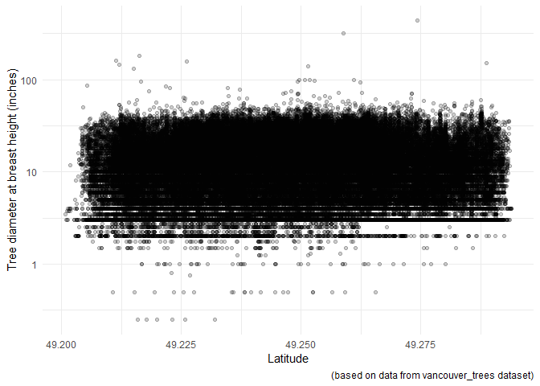
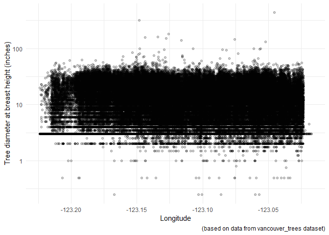
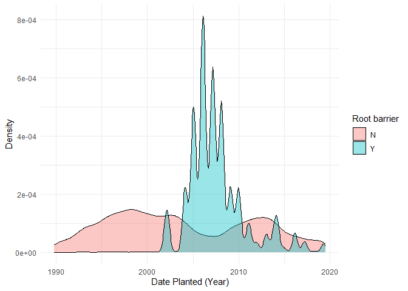
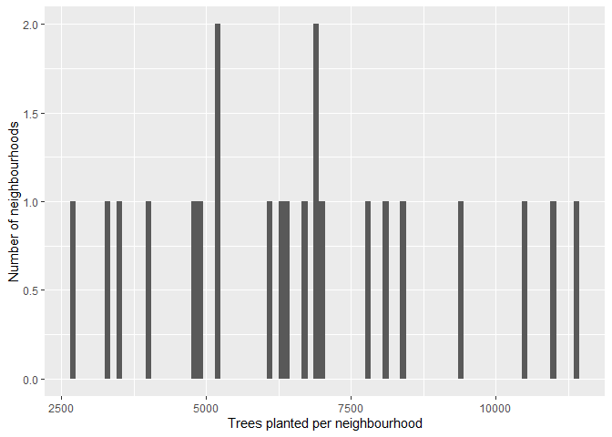
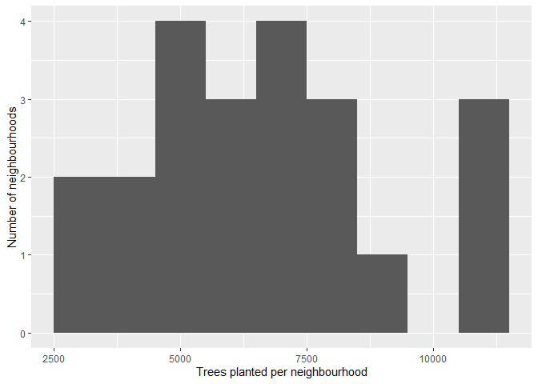
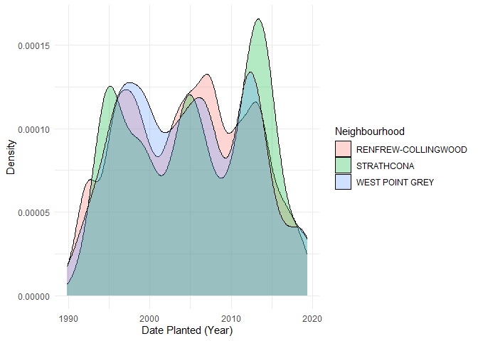
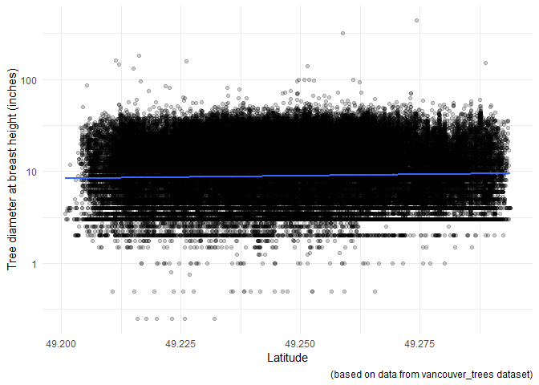

Mini Data Analysis Milestone 2
================

*To complete this milestone, you can either edit [this `.rmd`
file](https://raw.githubusercontent.com/UBC-STAT/stat545.stat.ubc.ca/master/content/mini-project/mini-project-2.Rmd)
directly. Fill in the sections that are commented out with
`<!--- start your work here--->`. When you are done, make sure to knit
to an `.md` file by changing the output in the YAML header to
`github_document`, before submitting a tagged release on canvas.*

# Welcome to the rest of your mini data analysis project!

In Milestone 1, you explored your data. and came up with research
questions. This time, we will finish up our mini data analysis and
obtain results for your data by:

- Making summary tables and graphs
- Manipulating special data types in R: factors and/or dates and times.
- Fitting a model object to your data, and extract a result.
- Reading and writing data as separate files.

We will also explore more in depth the concept of *tidy data.*

**NOTE**: The main purpose of the mini data analysis is to integrate
what you learn in class in an analysis. Although each milestone provides
a framework for you to conduct your analysis, it’s possible that you
might find the instructions too rigid for your data set. If this is the
case, you may deviate from the instructions – just make sure you’re
demonstrating a wide range of tools and techniques taught in this class.

# Instructions

**To complete this milestone**, edit [this very `.Rmd`
file](https://raw.githubusercontent.com/UBC-STAT/stat545.stat.ubc.ca/master/content/mini-project/mini-project-2.Rmd)
directly. Fill in the sections that are tagged with
`<!--- start your work here--->`.

**To submit this milestone**, make sure to knit this `.Rmd` file to an
`.md` file by changing the YAML output settings from
`output: html_document` to `output: github_document`. Commit and push
all of your work to your mini-analysis GitHub repository, and tag a
release on GitHub. Then, submit a link to your tagged release on canvas.

**Points**: This milestone is worth 50 points: 45 for your analysis, and
5 for overall reproducibility, cleanliness, and coherence of the Github
submission.

**Research Questions**: In Milestone 1, you chose two research questions
to focus on. Wherever realistic, your work in this milestone should
relate to these research questions whenever we ask for justification
behind your work. In the case that some tasks in this milestone don’t
align well with one of your research questions, feel free to discuss
your results in the context of a different research question.

# Learning Objectives

By the end of this milestone, you should:

- Understand what *tidy* data is, and how to create it using `tidyr`.
- Generate a reproducible and clear report using R Markdown.
- Manipulating special data types in R: factors and/or dates and times.
- Fitting a model object to your data, and extract a result.
- Reading and writing data as separate files.

# Setup

Begin by loading your data and the tidyverse package below:

``` r
library(datateachr) # <- might contain the data you picked!
library(tidyverse)
library(broom)
library(here)
```

# Task 1: Process and summarize your data

From milestone 1, you should have an idea of the basic structure of your
dataset (e.g. number of rows and columns, class types, etc.). Here, we
will start investigating your data more in-depth using various data
manipulation functions.

### 1.1 (1 point)

First, write out the 4 research questions you defined in milestone 1
were. This will guide your work through milestone 2:

<!-------------------------- Start your work below ---------------------------->

#### Research Questions

1.  Is tree size (height and diameter) correlated with the location in
    which the tree is planted?
2.  How have tree planting practices changed over time? - *For example,
    has the popularity of root boxes changed over time?*  
3.  How does diversity in tree species vary between neighborhoods and
    plant areas (e.g., along streets vs. in parks)?  
4.  How has the number of trees planted in different neighborhoods
    around Vancouver changed over time?
    <!----------------------------------------------------------------------------->

Here, we will investigate your data using various data manipulation and
graphing functions.

### 1.2 (8 points)

Now, for each of your four research questions, choose one task from
options 1-4 (summarizing), and one other task from 4-8 (graphing). You
should have 2 tasks done for each research question (8 total). Make sure
it makes sense to do them! (e.g. don’t use a numerical variables for a
task that needs a categorical variable.). Comment on why each task helps
(or doesn’t!) answer t he corresponding research question.

Ensure that the output of each operation is printed!

Also make sure that you’re using dplyr and ggplot2 rather than base R.
Outside of this project, you may find that you prefer using base R
functions for certain tasks, and that’s just fine! But part of this
project is for you to practice the tools we learned in class, which is
dplyr and ggplot2.

**Summarizing:**

1.  Compute the *range*, *mean*, and *two other summary statistics* of
    **one numerical variable** across the groups of **one categorical
    variable** from your data.
2.  Compute the number of observations for at least one of your
    categorical variables. Do not use the function `table()`!
3.  Create a categorical variable with 3 or more groups from an existing
    numerical variable. You can use this new variable in the other
    tasks! *An example: age in years into “child, teen, adult, senior”.*
4.  Compute the proportion and counts in each category of one
    categorical variable across the groups of another categorical
    variable from your data. Do not use the function `table()`!

**Graphing:**

6.  Create a graph of your choosing, make one of the axes logarithmic,
    and format the axes labels so that they are “pretty” or easier to
    read.
7.  Make a graph where it makes sense to customize the alpha
    transparency.

Using variables and/or tables you made in one of the “Summarizing”
tasks:

8.  Create a graph that has at least two geom layers.
9.  Create 3 histograms, with each histogram having different sized
    bins. Pick the “best” one and explain why it is the best.

Make sure it’s clear what research question you are doing each operation
for!

<!------------------------- Start your work below ----------------------------->

#### Research Question 1

##### Summarizing: Task 3

First, I will create a categorical variable, **diameter_group**, with
three groups from the existing **diameter** variable of the
*vancouver_trees* dataset. I will split the diameters into small (0-20
inches), medium (21-40 inches), and large (\>40 inches) diameter
categories. I will store the dataset with this new variable in
*vancouver_trees_1*. I will also print a summary table (called
*vancouver_trees_1_summary*) to show how many trees are in each diameter
size group. This task will somewhat help to answer research question 1,
as it provides some additional understanding of the overall distribution
of tree diameters in this dataset. However, it doesn’t tell us anything
about how tree diameter relates to location.

``` r
#CREATE CATEGORICAL VARIABLE FOR DIAMETER GROUPS
vancouver_trees_1 <- vancouver_trees %>% #select dataset
   mutate(diameter_group = factor(case_when(diameter < 21 ~ "small",
                                        diameter < 41 ~ "medium",
                                        TRUE ~ "large"),
                              levels = c('small', 'medium', 'large'))) %>% #add new variable for diameter groups
  select(tree_id,civic_number,diameter,diameter_group,everything()) #reorder columns to make sure diameter and diameter_group are easily visible in printed tibble
print(vancouver_trees_1)
```

    ## # A tibble: 146,611 × 21
    ##    tree_id civic_number diameter diameter_group std_street    genus_name
    ##      <dbl>        <dbl>    <dbl> <fct>          <chr>         <chr>     
    ##  1  149556          494     10   small          W 58TH AV     ULMUS     
    ##  2  149563          450     10   small          W 58TH AV     ZELKOVA   
    ##  3  149579         4994      4   small          WINDSOR ST    STYRAX    
    ##  4  149590          858     18   small          E 39TH AV     FRAXINUS  
    ##  5  149604         5032      9   small          WINDSOR ST    ACER      
    ##  6  149616          585      5   small          W 61ST AV     PYRUS     
    ##  7  149617         4909     15   small          SHERBROOKE ST ACER      
    ##  8  149618         4925     14   small          SHERBROOKE ST ACER      
    ##  9  149619         4969     16   small          SHERBROOKE ST ACER      
    ## 10  149625          720      7.5 small          E 39TH AV     FRAXINUS  
    ## # ℹ 146,601 more rows
    ## # ℹ 15 more variables: species_name <chr>, cultivar_name <chr>,
    ## #   common_name <chr>, assigned <chr>, root_barrier <chr>, plant_area <chr>,
    ## #   on_street_block <dbl>, on_street <chr>, neighbourhood_name <chr>,
    ## #   street_side_name <chr>, height_range_id <dbl>, curb <chr>,
    ## #   date_planted <date>, longitude <dbl>, latitude <dbl>

``` r
#CREATE AND PRINT OUT SUMMARY TIBBLE WITH NUMBER OF TREES IN EACH SIZE GROUP
vancouver_trees_1_summary <- vancouver_trees_1 %>%
  group_by(diameter_group) %>%
  summarise(num_trees=n())
print(vancouver_trees_1_summary)
```

    ## # A tibble: 3 × 2
    ##   diameter_group num_trees
    ##   <fct>              <int>
    ## 1 small             123169
    ## 2 medium             22589
    ## 3 large                853

##### Graphing: Task 6

Next, I will create scatter plots of tree diameter versus latitude and
longitude to visualize if there is a relationship between tree size and
geographical position. I will use a logarithmic scale for the diameter
axis.

``` r
#PLOT TREE DIAMETER VERSUS LATITUDE
vancouver_trees %>% #select dataset
  filter(diameter!=0) %>% #remove trees with a diameter of 0
  filter(!is.na(latitude)) %>% #remove trees with no latitude data
  ggplot(aes(x=latitude,y=diameter)) +
  geom_point(alpha=0.2) + #make scatter plot of tree diameter versus latitude
  scale_y_log10()+
  xlab("Latitude")+
  ylab("Tree diameter at breast height (inches)")+
  labs(caption="(based on data from vancouver_trees dataset)")+
  theme_minimal()
```

<!-- -->

``` r
#PLOT TREE DIAMETER VERSUS LONGITUDE
vancouver_trees %>% #select dataset
  filter(diameter!=0) %>% #remove trees with a diameter of 0
  filter(!is.na(longitude)) %>% #remove trees with no longitude data
  ggplot(aes(x=longitude,y=diameter)) +
  geom_point(alpha=0.2) + #make scatter plot of tree diameter versus longitude
  scale_y_log10()+
  xlab("Longitude")+
  ylab("Tree diameter at breast height (inches)")+
  labs(caption="(based on data from vancouver_trees dataset)")+
  theme_minimal()
```

<!-- -->

These plots are helpful in answering this research question. Namely,
they demonstrate that there is little noticeable relationship between
tree diameter and latitude/longitude. There is considerable scatter in
the diameter data, regardless of latitude/longitude, suggesting that
other variables likely affect tree diameter.

#### Reasearch Question 2

##### Summarizing: Task 2

First, I will compute the number of observations for two categorical
variables: **root_barrier** and **plant_area** and store the results in
*vancouver_trees_2a* and *vancouver_trees_2b*, respectively. While this
doesn’t get to answering the research question about how tree planting
practices have changed over time, it gives us a better understanding of
how common different tree planting practices (e.g., root barrier vs. no
root barrier and type of location in which the tree is planted) are
overall. Note that numeric **plant_area** values represent a boulevard
width in feet for boulevard trees, while letter values specify different
types of plant locations such as cutout, park, in tree grate, etc.

**Root barrier observations**

``` r
#COMPUTE NUMBER OF OBSERVATIONS FOR ROOT BARRIER
vancouver_trees_2a <- vancouver_trees %>% #select dataset
  group_by(root_barrier) %>%
  summarise(num_trees=n())
print(vancouver_trees_2a)
```

    ## # A tibble: 2 × 2
    ##   root_barrier num_trees
    ##   <chr>            <int>
    ## 1 N               137455
    ## 2 Y                 9156

**Plant area observations**

``` r
#COMPUTE NUMBER OF OBSERVATIONS FOR PLANT AREA
vancouver_trees_2b <- vancouver_trees %>% #select dataset
  group_by(plant_area) %>%
  summarise(num_trees=n())
print(vancouver_trees_2b)
```

    ## # A tibble: 49 × 2
    ##    plant_area num_trees
    ##    <chr>          <int>
    ##  1 0                  3
    ##  2 1                 33
    ##  3 10             20467
    ##  4 11              1235
    ##  5 12              9198
    ##  6 13               290
    ##  7 14               422
    ##  8 15              1617
    ##  9 16               215
    ## 10 17               102
    ## # ℹ 39 more rows

##### Graphing: Task 7

Next, I will create a density plot to visualise the number of trees
planted with or without a root barrier over time. I will modify the
alpha transparency so the “yes” and “no” plots can be well-visualized on
the same set of axes.

``` r
#DENSITY PLOT OF ROOT BARRIER USE OVER TIME
vancouver_trees %>% #select dataset
  ggplot(aes(x=date_planted))+ #select diameter as the continuous variable on the x-axis
  geom_density(aes(fill=root_barrier),na.rm=TRUE,alpha=0.4)+ #colour according to the value of root_barrier (Y/N)
  guides(fill=guide_legend(title="Root barrier"))+ #specify colour legend title
  xlab("Date Planted (Year)")+
  ylab("Density")+
  theme_minimal()
```

<!-- -->

This plot partly answers this research question. In particular, it shows
us that the use of root barriers has changed over time. Before 2000,
root barriers were not used. The use of root barriers was greatest for
trees planted between about 2003 and 2010, becoming less popular in the
period of 2010-2020.

#### Research Question 3

##### Summarizing: Task 2

For this research question, I will first look at the number of trees
planted in each Vancouver neighbourhood. That is, I’ll count the number
of observations for the categorical variable, **neighbourhood_name**.
The result will be stored in *vancouver_trees_3*. Similarly to the
summarizing tasks for the previous research questions, this won’t
directly answer the research question about how tree species vary
between neighbourhoods and plant areas, but it will tell us about how
many trees were planted in each neighbourhood and which neighbourhoods
had the most trees planted during the time period considered in this
dataset.

``` r
#FIND NUMBER OF TREES PLANTED IN EACH NEIGHBOURHOOD
vancouver_trees_3 <- vancouver_trees %>% #select dataset
  group_by(neighbourhood_name) %>%
  summarise(num_trees=n()) %>%
  arrange(desc(num_trees)) #arrange in descending order
print(vancouver_trees_3)
```

    ## # A tibble: 22 × 2
    ##    neighbourhood_name       num_trees
    ##    <chr>                        <int>
    ##  1 RENFREW-COLLINGWOOD          11386
    ##  2 KENSINGTON-CEDAR COTTAGE     11042
    ##  3 HASTINGS-SUNRISE             10547
    ##  4 DUNBAR-SOUTHLANDS             9415
    ##  5 SUNSET                        8367
    ##  6 KITSILANO                     8115
    ##  7 VICTORIA-FRASERVIEW           7789
    ##  8 SHAUGHNESSY                   7009
    ##  9 KERRISDALE                    6936
    ## 10 RILEY PARK                    6870
    ## # ℹ 12 more rows

From these results, we can see that the most trees were planted in
Renfrew-Collingwood and the least trees were planted in Strathcona.

##### Graphing: Task 9

For this task, I’ll create three histograms, each using a different bin
width (100, 1000, and 2000). In these histograms, I’ll plot the variable
**num_trees** that I just created in the vancouver_trees_3 dataset,
which represents the number of trees planted in each neighbourhood.
Hence, these histograms will show the frequency of different numbers of
trees planted per neighbourhood during this ~30-year time period. This
won’t add considerable value in answering the research question, but
will help to visualize how many trees were typically planted per
neighbourhood during this time period.

**Bin width = 100**

``` r
#HISTOGRAM WITH BIN WIDTH = 100
vancouver_trees_3 %>%
  ggplot(aes(x=num_trees)) +
  geom_histogram(binwidth=100) +
  xlab("Trees planted per neighbourhood") +
  ylab("Number of neighbourhoods")
```

<!-- -->

**Bin width = 1000**

``` r
#HISTOGRAM WITH BIN WIDTH = 1000
vancouver_trees_3 %>%
  ggplot(aes(x=num_trees)) +
  geom_histogram(binwidth=1000) +
  xlab("Trees planted per neighbourhood") +
  ylab("Number of neighbourhoods")
```

<!-- -->

**Bin width = 2000**

``` r
#HISTOGRAM WITH BIN WIDTH = 2000
vancouver_trees_3 %>%
  ggplot(aes(x=num_trees)) +
  geom_histogram(binwidth=2000) +
  xlab("Trees planted per neighbourhood") +
  ylab("Number of neighbourhoods")
```

<!-- -->

Of the bin sizes tested here, I think 1000 is the best. I think that a
bin size of 100 is too small, as most bins only contain 1 occurrence,
making it difficult to visualize trends. When comparing bin sizes of
1000 and 2000, we can see that with a bin size of 2000 we lose some
information, such as the fact that no neighbourhoods had 9500-10500
trees planted during this period. Thus, I think that a bin size of 1000
is a nice compromise between showing sufficient detail, while allowing
for visualization of some trends.

#### Research Question 4

##### Summarizing: Task 3

In this task, I will create a new categorical variable called
**date_planted_group** to group the **date_planted** variable into six
~5-year groups (before 1995, 1995-1999, 2000-2004, 2005-2009, 2010-2014,
and 2015 & after). The resulting tibble will be stored in
**vancouver_trees_4**. While this doesn’t answer the research question
about how the number of trees planted in different neighbourhoods has
changed over time, I will print a summary table showing the number of
trees planted during each time group to learn some information about how
the overall number of trees planted has changed with time across these
five-year time chunks. The summary table will be stored in
**vancouver_trees_4_summary**.

``` r
#CREATE NEW CATEGORICAL VARIABLE TO GROUP DATE PLANTED VALUES
vancouver_trees_4 <- vancouver_trees %>%
   mutate(date_planted_group = factor(case_when(date_planted < "1995-01-01" ~ "before 1995",
                                        date_planted < "2000-01-01" ~ "1995-1999",
                                        date_planted < "2005-01-01" ~ "2000-2004",
                                        date_planted < "2010-01-01" ~ "2005-2009",
                                        date_planted < "2015-01-01" ~ "2010-2014",
                                        TRUE ~ "2015 and after"),
                              levels = c('before 1995','1995-1999','2000-2004','2005-2009','2010-2014','2015 and after'))) %>%
  select(tree_id,civic_number,date_planted,date_planted_group,everything()) #reorder columns to make sure date_planted and date_planted_group are easily visible in the printed table
print(vancouver_trees_4)
```

    ## # A tibble: 146,611 × 21
    ##    tree_id civic_number date_planted date_planted_group std_street    genus_name
    ##      <dbl>        <dbl> <date>       <fct>              <chr>         <chr>     
    ##  1  149556          494 1999-01-13   1995-1999          W 58TH AV     ULMUS     
    ##  2  149563          450 1996-05-31   1995-1999          W 58TH AV     ZELKOVA   
    ##  3  149579         4994 1993-11-22   before 1995        WINDSOR ST    STYRAX    
    ##  4  149590          858 1996-04-29   1995-1999          E 39TH AV     FRAXINUS  
    ##  5  149604         5032 1993-12-17   before 1995        WINDSOR ST    ACER      
    ##  6  149616          585 NA           2015 and after     W 61ST AV     PYRUS     
    ##  7  149617         4909 1993-12-16   before 1995        SHERBROOKE ST ACER      
    ##  8  149618         4925 1993-12-16   before 1995        SHERBROOKE ST ACER      
    ##  9  149619         4969 1993-12-16   before 1995        SHERBROOKE ST ACER      
    ## 10  149625          720 1993-12-03   before 1995        E 39TH AV     FRAXINUS  
    ## # ℹ 146,601 more rows
    ## # ℹ 15 more variables: species_name <chr>, cultivar_name <chr>,
    ## #   common_name <chr>, assigned <chr>, root_barrier <chr>, plant_area <chr>,
    ## #   on_street_block <dbl>, on_street <chr>, neighbourhood_name <chr>,
    ## #   street_side_name <chr>, height_range_id <dbl>, diameter <dbl>, curb <chr>,
    ## #   longitude <dbl>, latitude <dbl>

``` r
#PRINT SUMMARY TABLE SHOWING TOTAL NUMBER OF TREES PLANTED IN EACH TIME PERIOD
vancouver_trees_4_summary <- vancouver_trees_4 %>%
  group_by(date_planted_group) %>%
  summarise(num_trees=n())
print(vancouver_trees_4_summary)
```

    ## # A tibble: 6 × 2
    ##   date_planted_group num_trees
    ##   <fct>                  <int>
    ## 1 before 1995             7790
    ## 2 1995-1999              15122
    ## 3 2000-2004              14870
    ## 4 2005-2009              13794
    ## 5 2010-2014              12881
    ## 6 2015 and after         82154

##### Graphing: Task 7

As the last task in this activity, I will select a few neighbourhoods of
interest and create density plots to visualize the number of trees
planted over time in each of these neighbourhoods. This will help me to
answer the research question, as it will show how the number of trees
planted in different neighbourhoods has changed over time. For this
task, I’ll focus on the neighbourhoods in which the greatest
(Renfrew-Collingwood) and least (Strathcona) number of trees were
planted during this dataset’s time period. I’ll also look at West Point
Grey, since that is the neighbourhood that includes UBC.

``` r
vancouver_trees %>%
  filter(neighbourhood_name %in% c("RENFREW-COLLINGWOOD","STRATHCONA","WEST POINT GREY")) %>%
  ggplot(aes(x=date_planted))+ #select date planted as the continuous variable on the x-axis
  geom_density(aes(fill=neighbourhood_name),na.rm=TRUE,alpha=0.3)+ #colour based on neighbourhood
  guides(fill=guide_legend(title="Neighbourhood"))+ #specify colour legend title
  xlab("Date Planted (Year)")+
  ylab("Density")+
  theme_minimal()
```

<!-- -->

This plot demonstrates an interesting pattern in tree planting over the
years. Namely, between 1990 and 2020, there appear to have been three
“waves” of tree planting that largely overlap for all three
neighbourhoods. For each neighbourhood, adjacent “waves” have similar
amplitudes, aside from the most recent “wave” of tree planting in
Strathcona, which is greater than the previous two waves for that
neighbourhood.  
<!----------------------------------------------------------------------------->

### 1.3 (2 points)

Based on the operations that you’ve completed, how much closer are you
to answering your research questions? Think about what aspects of your
research questions remain unclear. Can your research questions be
refined, now that you’ve investigated your data a bit more? Which
research questions are yielding interesting results?

<!------------------------- Write your answer here ---------------------------->

#### Progress toward answering research questions

Based on the operations completed, I have made good progress in
answering research questions 1, 2, and 4.  
- For **research question 1**, I used scatter plots to learn that tree
diameter is largely independent of the latitude and longitude of the
location in which the tree was planted. This makes sense, as the
geographic area over which these tree data were collected is likely too
small for differences in latitude and longitude to largely influence
tree growing conditions. I have not yet explored the relationship
between tree height and the location in which the tree was planted.  
- For **research question 2**, I was able to answer how tree planting
practices have changed over time in terms of the use of root barriers
using a density plot. Interestingly, this showed that root barriers were
most popular for trees planted between 2003-2010. However, this research
question is fairly broad, so I have not yet been able to fully answer
how other tree planting practices (e.g., plant areas) have changed over
time.  
- For **research question 3**, I didn’t make much progress toward
answering how tree species vary between different neighbourhoods and
different plant areas. Instead, I learned more about the total number of
trees planted in various neighbourhoods. This research question is a bit
challenging to investigate given that there are so many different tree
species in this dataset. This makes it difficult to make clean visuals
to display the data. Perhaps it would have been more feasible to narrow
down this question to something like “what is the most popular tree
species in each neighbourhood?”  
- For **research question 4**, I made good progress toward answering how
the number of trees planted in different neighbourhoods has changed over
time. In particular, the density plots that I generated for three
neighbourhoods showed interesting wave-like patterns in tree planting
over time. It would be interesting to investigate the remaining
Vancouver neighbourhoods to see if this pattern is seen elsewhere.

<!----------------------------------------------------------------------------->

# Task 2: Tidy your data

In this task, we will do several exercises to reshape our data. The goal
here is to understand how to do this reshaping with the `tidyr` package.

A reminder of the definition of *tidy* data:

- Each row is an **observation**
- Each column is a **variable**
- Each cell is a **value**

### 2.1 (2 points)

Based on the definition above, can you identify if your data is tidy or
untidy? Go through all your columns, or if you have \>8 variables, just
pick 8, and explain whether the data is untidy or tidy.

<!--------------------------- Start your work below --------------------------->

#### Tidiness evaluation

First, I will create a smaller version of the dataset (called
*vancouver_trees_smaller*) with just 8 variables to make it more
manageable and inspect if it is tidy or untidy.

``` r
vancouver_trees_smaller <- vancouver_trees %>%
  select(tree_id,genus_name,species_name,root_barrier,plant_area,neighbourhood_name,diameter,date_planted)
head(vancouver_trees_smaller)
```

    ## # A tibble: 6 × 8
    ##   tree_id genus_name species_name root_barrier plant_area neighbourhood_name    
    ##     <dbl> <chr>      <chr>        <chr>        <chr>      <chr>                 
    ## 1  149556 ULMUS      AMERICANA    N            N          MARPOLE               
    ## 2  149563 ZELKOVA    SERRATA      N            N          MARPOLE               
    ## 3  149579 STYRAX     JAPONICA     N            4          KENSINGTON-CEDAR COTT…
    ## 4  149590 FRAXINUS   AMERICANA    N            4          KENSINGTON-CEDAR COTT…
    ## 5  149604 ACER       CAMPESTRE    N            4          KENSINGTON-CEDAR COTT…
    ## 6  149616 PYRUS      CALLERYANA   N            B          MARPOLE               
    ## # ℹ 2 more variables: diameter <dbl>, date_planted <date>

The definition of tidy data requires that:  
- Each variable is a column  
- Each observation forms a row  
- Each cell is a single measurement

Based on this definition of tidy data, I think that the vancouver_trees
dataset is tidy. Indeed, each variable (tree id, species, presence of
root barrier, plant area, neighbourhood, etc.) is a column in the
dataset. Additionally, each row represents an observation (a unique
tree). Each cell contains one single measurement or piece of info about
the corresponding tree. However, this definition of “tidy” somewhat
depends on what you want to do with the data. For this data analysis,
the dataset is in a tidy format for all of the tasks I have completed so
far.

One potential exception to this is the plant area variable. This
variable implicitly contains two pieces of information for boulevard
trees (trees with numerical **plant_area** values). For boulevard trees,
this column contains the implicit information that (a) they are located
on a boulevard **as well as** (b) the boulevard width. Depending on the
task at hand, it may be more tidy to have a separate column for the
boulevard width data.
<!----------------------------------------------------------------------------->

### 2.2 (4 points)

Now, if your data is tidy, untidy it! Then, tidy it back to it’s
original state.

If your data is untidy, then tidy it! Then, untidy it back to it’s
original state.

Be sure to explain your reasoning for this task. Show us the “before”
and “after”.

<!--------------------------- Start your work below --------------------------->

#### Tidying and untidying

First, I will untidy the data in *vancouver_trees_smaller* and call the
resulting dataset *vancouver_trees_untidy*. To do this, I will make the
data longer by pivoting the columns **genus_name** and **species_name**
into a longer format. I will to this by creating a column called
**taxonomic_rank** in which the specification of genus or species will
be held. A column called **name** will hold the names of the species or
genus (depending on which of these is specified in **taxonomic_rank**).
Thus, for each tree, there will be 2 rows, one that will hold the
species info and another that will hold the genus info. For most
applications, this seems to be a rather inefficient way of organizing
the data. Below, I will print the untidy version of the data after
pivoting it longer.

``` r
#UN-TIDY THE DATA
vancouver_trees_untidy <- vancouver_trees_smaller %>% #select dataset
  pivot_longer(cols=c(species_name,genus_name),
               names_to=c("taxonomic_rank",".value"),
               names_sep="_") %>% #pivot the table longer to create new column to specify genus or species info
  select(tree_id, taxonomic_rank,name,everything()) #re-order the columns

#PRINT THE RESULT
print(vancouver_trees_untidy) #check the resulting table
```

    ## # A tibble: 293,222 × 8
    ##    tree_id taxonomic_rank name      root_barrier plant_area neighbourhood_name  
    ##      <dbl> <chr>          <chr>     <chr>        <chr>      <chr>               
    ##  1  149556 species        AMERICANA N            N          MARPOLE             
    ##  2  149556 genus          ULMUS     N            N          MARPOLE             
    ##  3  149563 species        SERRATA   N            N          MARPOLE             
    ##  4  149563 genus          ZELKOVA   N            N          MARPOLE             
    ##  5  149579 species        JAPONICA  N            4          KENSINGTON-CEDAR CO…
    ##  6  149579 genus          STYRAX    N            4          KENSINGTON-CEDAR CO…
    ##  7  149590 species        AMERICANA N            4          KENSINGTON-CEDAR CO…
    ##  8  149590 genus          FRAXINUS  N            4          KENSINGTON-CEDAR CO…
    ##  9  149604 species        CAMPESTRE N            4          KENSINGTON-CEDAR CO…
    ## 10  149604 genus          ACER      N            4          KENSINGTON-CEDAR CO…
    ## # ℹ 293,212 more rows
    ## # ℹ 2 more variables: diameter <dbl>, date_planted <date>

Now, I will pivot the table wider again to return the data to its
original tidy state. I will call the resulting dataset
*vancouver_trees_tidy*. I will print the original dataset, followed by
the re-tidied dataset to make them easy to compare and to make sure they
are identical.

``` r
#RE-TIDY THE DATA
vancouver_trees_tidy <- vancouver_trees_untidy %>% #select the untidied dataset
  pivot_wider(names_from=taxonomic_rank,
              names_glue="{taxonomic_rank}_name",
               values_from=name) %>% #pivot the table wider to restore separate genus_name & species_name columns
  select(tree_id, genus_name,species_name,everything()) #change order of columns

#COMPARE RE-TIDIED DATA TO THE ORIGINAL TIDY DATA
print(vancouver_trees_smaller) #print original tidy dataset to make checking easy
```

    ## # A tibble: 146,611 × 8
    ##    tree_id genus_name species_name root_barrier plant_area neighbourhood_name   
    ##      <dbl> <chr>      <chr>        <chr>        <chr>      <chr>                
    ##  1  149556 ULMUS      AMERICANA    N            N          MARPOLE              
    ##  2  149563 ZELKOVA    SERRATA      N            N          MARPOLE              
    ##  3  149579 STYRAX     JAPONICA     N            4          KENSINGTON-CEDAR COT…
    ##  4  149590 FRAXINUS   AMERICANA    N            4          KENSINGTON-CEDAR COT…
    ##  5  149604 ACER       CAMPESTRE    N            4          KENSINGTON-CEDAR COT…
    ##  6  149616 PYRUS      CALLERYANA   N            B          MARPOLE              
    ##  7  149617 ACER       PLATANOIDES  N            6          KENSINGTON-CEDAR COT…
    ##  8  149618 ACER       PLATANOIDES  N            6          KENSINGTON-CEDAR COT…
    ##  9  149619 ACER       PLATANOIDES  N            3          KENSINGTON-CEDAR COT…
    ## 10  149625 FRAXINUS   AMERICANA    N            3          KENSINGTON-CEDAR COT…
    ## # ℹ 146,601 more rows
    ## # ℹ 2 more variables: diameter <dbl>, date_planted <date>

``` r
print(vancouver_trees_tidy) #print the re-tidied dataset
```

    ## # A tibble: 146,611 × 8
    ##    tree_id genus_name species_name root_barrier plant_area neighbourhood_name   
    ##      <dbl> <chr>      <chr>        <chr>        <chr>      <chr>                
    ##  1  149556 ULMUS      AMERICANA    N            N          MARPOLE              
    ##  2  149563 ZELKOVA    SERRATA      N            N          MARPOLE              
    ##  3  149579 STYRAX     JAPONICA     N            4          KENSINGTON-CEDAR COT…
    ##  4  149590 FRAXINUS   AMERICANA    N            4          KENSINGTON-CEDAR COT…
    ##  5  149604 ACER       CAMPESTRE    N            4          KENSINGTON-CEDAR COT…
    ##  6  149616 PYRUS      CALLERYANA   N            B          MARPOLE              
    ##  7  149617 ACER       PLATANOIDES  N            6          KENSINGTON-CEDAR COT…
    ##  8  149618 ACER       PLATANOIDES  N            6          KENSINGTON-CEDAR COT…
    ##  9  149619 ACER       PLATANOIDES  N            3          KENSINGTON-CEDAR COT…
    ## 10  149625 FRAXINUS   AMERICANA    N            3          KENSINGTON-CEDAR COT…
    ## # ℹ 146,601 more rows
    ## # ℹ 2 more variables: diameter <dbl>, date_planted <date>

Comparing *vancouver_trees_tidy* and *vancouver_trees_smaller* shows
that these datasets have the exact same columns, number of rows, and
identical data, showing that the data was successfully re-tidied.  
<!----------------------------------------------------------------------------->

### 2.3 (4 points)

Now, you should be more familiar with your data, and also have made
progress in answering your research questions. Based on your interest,
and your analyses, pick 2 of the 4 research questions to continue your
analysis in the remaining tasks:

<!-------------------------- Start your work below ---------------------------->

**Research questions for remaining tasks**  
1. How have tree planting practices changed over time? - *In particular,
how has the popularity of different plant areas changed over time?*  
2. How does diversity in tree species vary between neighborhoods and
plant areas?

<!----------------------------------------------------------------------------->

Explain your decision for choosing the above two research questions.

<!--------------------------- Start your work below --------------------------->

**Justification**  
I selected these two research questions, as I believe that I have made
less progress in answering these two than the other two research
questions so far.  
<!----------------------------------------------------------------------------->

Now, try to choose a version of your data that you think will be
appropriate to answer these 2 questions. Use between 4 and 8 functions
that we’ve covered so far (i.e. by filtering, cleaning, tidy’ing,
dropping irrelevant columns, etc.).

(If it makes more sense, then you can make/pick two versions of your
data, one for each research question.)

<!--------------------------- Start your work below --------------------------->

#### Modifying data for answering research questions

I will make two versions of the data, one to answer each question.

**Version 1 to address the following research question: How have tree
planting practices changed over time?**  
I will focus on the part of this question that I didn’t previously
address: how has the popularity of different tree planting areas changed
over time. The possible values for **plant_area** include letters, which
represent different types of places in which trees can be planted (e.g.,
B = behind sidewalk, C = cutout, G = in tree grate, etc.), as well as
numbers, which represent boulevard widths. To make these categories
easier to deal with, I will add a variable called **plant_area_group**,
which retains letter-based **plant_area** values and replaces numerical
values with “Bl” to mean boulevard. I will also remove columns
irrelevant to this question, filter out rows with NA values in the
**date_planted** and **plant_area** columns, then arrange the rows based
on **plant_area_group**. The resulting dataset will be called
*vancouver_trees_RQ1*.

``` r
#MANIPULATE DATASET
vancouver_trees_RQ1<- vancouver_trees %>%
  select(tree_id, plant_area, date_planted) %>% #select relevant columns
  filter(!is.na(date_planted)) %>% #remove rows lacking date_planted data
  filter(!is.na(plant_area)) %>% #remove rows lacking plant_area data
  mutate(plant_area_group = factor(case_when(plant_area %in% c("B","C","G","L","M","N","P","b","c","g","n","y") ~                                                  as.character(plant_area),
                                             TRUE ~ "Bl"))) %>% #new variable to describe plant area
  select(tree_id,plant_area,plant_area_group,date_planted) %>% #reorder columns
  arrange(plant_area_group) #arrange by plant area group

#CHECK RESULT
print(vancouver_trees_RQ1)
```

    ## # A tibble: 69,171 × 4
    ##    tree_id plant_area plant_area_group date_planted
    ##      <dbl> <chr>      <fct>            <date>      
    ##  1  159854 b          b                1995-04-03  
    ##  2  159856 b          b                1995-04-03  
    ##  3  184704 b          b                2000-03-03  
    ##  4  184705 b          b                2000-03-03  
    ##  5  189175 b          b                2001-10-30  
    ##  6  189227 b          b                2001-11-01  
    ##  7   22024 b          b                2008-11-19  
    ##  8   22027 b          b                2008-11-20  
    ##  9    3106 b          b                2009-12-03  
    ## 10    4904 b          b                2009-12-03  
    ## # ℹ 69,161 more rows

**Version 2 to address the following research question: How does
diversity in tree species vary between neighborhoods and plant areas
(e.g., along streets vs. in parks)?**  
For this part of the analysis, I will focus on learning about how the
diversity of tree species varies between neighbourhoods. I will create a
new dataset called vancouver_trees_RQ2, which includes rows for each
neighbourhood and columns for each tree species. In each row, the number
of trees of a given species planted in that neighbourhood will be
tabulated.

``` r
#MANIPULATE DATASET
vancouver_trees_RQ2 <- vancouver_trees %>% #select dataset
  select(tree_id,species_name,neighbourhood_name) %>% #select relevant columns
  filter(!is.na(species_name)) %>% #remove trees with no species name
  filter(!is.na(neighbourhood_name)) %>% #remove trees with no neighbourhood name
  group_by(neighbourhood_name,species_name) %>% 
  summarise(num_trees=n(),.groups="keep") %>%
  pivot_wider(names_from=species_name,
              values_from=num_trees) #yields table that summarizes number of each tree species in each neighbourhood

#CHECK RESULT
print(vancouver_trees_RQ2)
```

    ## # A tibble: 22 × 284
    ## # Groups:   neighbourhood_name [22]
    ##    neighbourhood_name      ABIES `ACERIFOLIA   X` ACUTISSIMA ALNIFOLIA AMERICANA
    ##    <chr>                   <int>            <int>      <int>     <int>     <int>
    ##  1 ARBUTUS-RIDGE               2              103          5        16       225
    ##  2 DOWNTOWN                    1              123         67         3        50
    ##  3 DUNBAR-SOUTHLANDS          11              168         23        18       435
    ##  4 FAIRVIEW                    7               19         NA         6       165
    ##  5 GRANDVIEW-WOODLAND          4               63         14         7       208
    ##  6 HASTINGS-SUNRISE            4               70         47        65       175
    ##  7 KENSINGTON-CEDAR COTTA…    15               64         81        13       747
    ##  8 KERRISDALE                  5               59          8         3       340
    ##  9 KILLARNEY                   4               57          8         2       206
    ## 10 KITSILANO                  17              141         23        16       260
    ## # ℹ 12 more rows
    ## # ℹ 278 more variables: AQUIFOLIUM <int>, ARIA <int>, `ARNOLDIANA X` <int>,
    ## #   AUCUPARIA <int>, AVIUM <int>, BABYLONICA <int>, BANKSIANA <int>,
    ## #   BETULUS <int>, BIGNONIOIDES <int>, BILOBA <int>, BLIREANA <int>,
    ## #   CALLERYANA <int>, CAMPESTRE <int>, CANADENSIS <int>, CAPPADOCICUM <int>,
    ## #   `CARNEA   X` <int>, CAROLINIANA <int>, CERASIFERA <int>, CINEREA <int>,
    ## #   CIRCINATUM <int>, COCCINEA <int>, CONTORTA <int>, CONTROVERSA <int>, …

<!----------------------------------------------------------------------------->

# Task 3: Modelling

## 3.0 (no points)

Pick a research question from 1.2, and pick a variable of interest
(we’ll call it “Y”) that’s relevant to the research question. Indicate
these.

<!-------------------------- Start your work below ---------------------------->

**Research Question**: Is tree size (height and diameter) correlated
with the location in which the tree is planted?

**Variable of interest**: Diameter

<!----------------------------------------------------------------------------->

## 3.1 (3 points)

Fit a model or run a hypothesis test that provides insight on this
variable with respect to the research question. Store the model object
as a variable, and print its output to screen. We’ll omit having to
justify your choice, because we don’t expect you to know about model
specifics in STAT 545.

- **Note**: It’s OK if you don’t know how these models/tests work. Here
  are some examples of things you can do here, but the sky’s the limit.

  - You could fit a model that makes predictions on Y using another
    variable, by using the `lm()` function.
  - You could test whether the mean of Y equals 0 using `t.test()`, or
    maybe the mean across two groups are different using `t.test()`, or
    maybe the mean across multiple groups are different using `anova()`
    (you may have to pivot your data for the latter two).
  - You could use `lm()` to test for significance of regression
    coefficients.

<!-------------------------- Start your work below ---------------------------->

#### Diameter model

I have decided to fit a linear regression model to the tree diameter
(“Y”) data as a function of latitude (“X”). I will store the model
object as a variable called **diam_lm**.

``` r
#FIT LINEAR MODEL FOR DIAMETER AS A FUNCTION OF LATITUDE
diam_lm <- lm(diameter ~ latitude, data=vancouver_trees) #create  linear model
print(diam_lm) #print result
```

    ## 
    ## Call:
    ## lm(formula = diameter ~ latitude, data = vancouver_trees)
    ## 
    ## Coefficients:
    ## (Intercept)     latitude  
    ##     -494.12        10.28

<!----------------------------------------------------------------------------->

## 3.2 (3 points)

Produce something relevant from your fitted model: either predictions on
Y, or a single value like a regression coefficient or a p-value.

- Be sure to indicate in writing what you chose to produce.
- Your code should either output a tibble (in which case you should
  indicate the column that contains the thing you’re looking for), or
  the thing you’re looking for itself.
- Obtain your results using the `broom` package if possible. If your
  model is not compatible with the broom function you’re needing, then
  you can obtain your results by some other means, but first indicate
  which broom function is not compatible.

<!-------------------------- Start your work below ---------------------------->

#### Extracting model info

I am most interested in extracting the R-squared value for the linear
regression to check how much of the variation in the tree diameter data
can be explained by the model. I can extract this information in a
couple ways; the first is with the glance() function from the broom
package. This gives a one-row tibble with all information about the
model, including the r-squared value in the **r.squared** column:

``` r
glance(diam_lm) #one row tibble with all model information
```

    ## # A tibble: 1 × 12
    ##   r.squared adj.r.squared sigma statistic  p.value    df   logLik     AIC    BIC
    ##       <dbl>         <dbl> <dbl>     <dbl>    <dbl> <dbl>    <dbl>   <dbl>  <dbl>
    ## 1  0.000546      0.000537  9.27      67.6 2.03e-16     1 -451461. 902927. 9.03e5
    ## # ℹ 3 more variables: deviance <dbl>, df.residual <int>, nobs <int>

Alternatively, the R-squared value can be extracted individually using
the code below:

``` r
summary(diam_lm)$r.squared #just extract the R-Squared value
```

    ## [1] 0.0005455144

It looks like the R-squared value is 5.4551444^{-4}. This is very small,
suggesting that the model doesn’t explain the variation in the data very
well. To look at this visually, I will create a scatter plot of the
diameter vs. latitude data (as in section 1.2), but this time I will
also use geom_smooth() to plot the linear model.

``` r
#PLOT TREE DIAMETER VERSUS LATITUDE, INCLUDING LINEAR MODEL
vancouver_trees %>%
  filter(diameter!=0) %>% #remove trees with a diameter of 0
  filter(!is.na(latitude)) %>% #remove trees with no latitude data
  ggplot(aes(x=latitude,y=diameter)) +
  geom_point(alpha=0.2) +
  geom_smooth(method = "lm") + #add the linear model
  scale_y_log10() +
  xlab("Latitude") +
  ylab("Tree diameter at breast height (inches)") +
  labs(caption="(based on data from vancouver_trees dataset)") +
  theme_minimal()
```

    ## `geom_smooth()` using formula = 'y ~ x'

<!-- -->

From the plot here, we can see that the model predicts a modest positive
correlation between diameter and latitude. However, the diamater data is
quite spread out, suggesting that diameter likely varies as a function
of other variables that are not investigated here. This makes sense, as
tree diameter likely also depends on the species, tree age, soil
quality, etc.  
<!----------------------------------------------------------------------------->

# Task 4: Reading and writing data

Get set up for this exercise by making a folder called `output` in the
top level of your project folder / repository. You’ll be saving things
there.

## 4.1 (3 points)

Take a summary table that you made from Task 1, and write it as a csv
file in your `output` folder. Use the `here::here()` function.

- **Robustness criteria**: You should be able to move your Mini Project
  repository / project folder to some other location on your computer,
  or move this very Rmd file to another location within your project
  repository / folder, and your code should still work.
- **Reproducibility criteria**: You should be able to delete the csv
  file, and remake it simply by knitting this Rmd file.

<!-------------------------- Start your work below ---------------------------->

#### Writing data

In this task, I will write my first summary table
(*vancouver_trees_1_summary*) from Task 1 to an output file called
vancouver_trees_1_summary.csv.

``` r
#CHECK IF THE OUTPUT FILE ALREADY EXISTS, AND DELETE IT IF IT DOES
csv_file_name <- "vancouver_trees_1_summary.csv"

if (file.exists(here::here("output",csv_file_name))){
  unlink(here::here("output",csv_file_name))
}

#WRITE vancouver_trees_1_summary TO A CSV FILE IN THE OUTPUT FOLDER
write_csv(vancouver_trees_1_summary, here::here("output",csv_file_name))
```

<!----------------------------------------------------------------------------->

## 4.2 (3 points)

Write your model object from Task 3 to an R binary file (an RDS), and
load it again. Be sure to save the binary file in your `output` folder.
Use the functions `saveRDS()` and `readRDS()`.

- The same robustness and reproducibility criteria as in 4.1 apply here.

<!-------------------------- Start your work below ---------------------------->

#### Write and read binary file

I will write a binary file called diam_lm.rds containing the diam_lm
model object in the object folder. I will then load it to the variable
diam_lm_loaded.

``` r
#WRITE MODEL OBJECT TO RDS FILE
rds_file_name <- "diam_lm.rds"

if (file.exists(here::here("output",rds_file_name))){
  unlink(here::here("output",rds_file_name)) #delete the file if it already exists
}

saveRDS(diam_lm, here::here("output",rds_file_name))

#LOAD RDS FILE CONTAINING MODEL OBJECT
diam_lm_loaded <- readRDS(here::here("output",rds_file_name))
```

<!----------------------------------------------------------------------------->

# Overall Reproducibility/Cleanliness/Coherence Checklist

Here are the criteria we’re looking for.

## Coherence (0.5 points)

The document should read sensibly from top to bottom, with no major
continuity errors.

The README file should still satisfy the criteria from the last
milestone, i.e. it has been updated to match the changes to the
repository made in this milestone.

## File and folder structure (1 points)

You should have at least three folders in the top level of your
repository: one for each milestone, and one output folder. If there are
any other folders, these are explained in the main README.

Each milestone document is contained in its respective folder, and
nowhere else.

Every level-1 folder (that is, the ones stored in the top level, like
“Milestone1” and “output”) has a `README` file, explaining in a sentence
or two what is in the folder, in plain language (it’s enough to say
something like “This folder contains the source for Milestone 1”).

## Output (1 point)

All output is recent and relevant:

- All Rmd files have been `knit`ted to their output md files.
- All knitted md files are viewable without errors on Github. Examples
  of errors: Missing plots, “Sorry about that, but we can’t show files
  that are this big right now” messages, error messages from broken R
  code
- All of these output files are up-to-date – that is, they haven’t
  fallen behind after the source (Rmd) files have been updated.
- There should be no relic output files. For example, if you were
  knitting an Rmd to html, but then changed the output to be only a
  markdown file, then the html file is a relic and should be deleted.

Our recommendation: delete all output files, and re-knit each
milestone’s Rmd file, so that everything is up to date and relevant.

## Tagged release (0.5 point)

You’ve tagged a release for Milestone 2.

### Attribution

Thanks to Victor Yuan for mostly putting this together.
