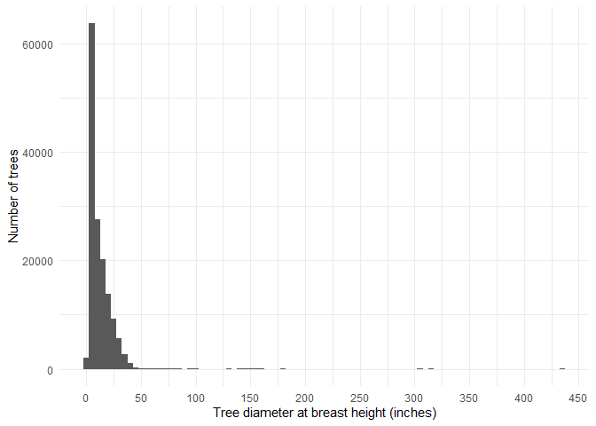
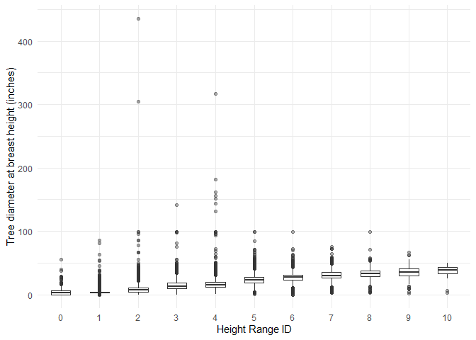
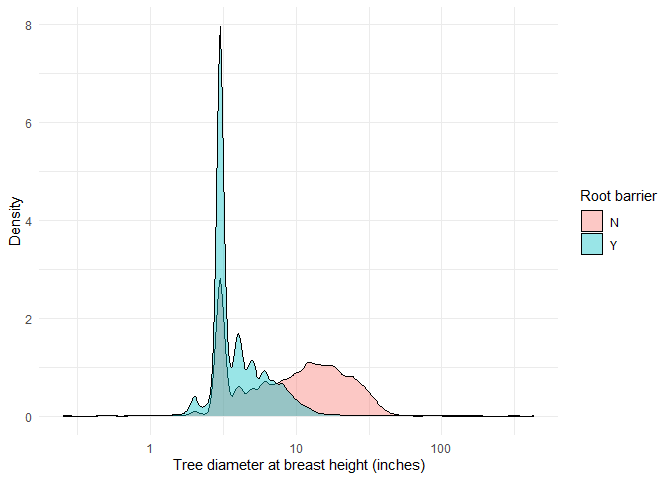

Mini Data-Analysis Deliverable 1
================
Lauren Puumala and Lucy Gao
2023-10-3

# Welcome to your (maybe) first-ever data analysis project!

And hopefully the first of many. Let’s get started:

1.  Install the [`datateachr`](https://github.com/UBC-MDS/datateachr)
    package by typing the following into your **R terminal**:

<!-- -->

    install.packages("devtools")
    devtools::install_github("UBC-MDS/datateachr")

2.  Load the packages below.

``` r
library(datateachr)
library(tidyverse)
```

    ## ── Attaching core tidyverse packages ──────────────────────── tidyverse 2.0.0 ──
    ## ✔ dplyr     1.1.3     ✔ readr     2.1.4
    ## ✔ forcats   1.0.0     ✔ stringr   1.5.0
    ## ✔ ggplot2   3.4.3     ✔ tibble    3.2.1
    ## ✔ lubridate 1.9.2     ✔ tidyr     1.3.0
    ## ✔ purrr     1.0.2     
    ## ── Conflicts ────────────────────────────────────────── tidyverse_conflicts() ──
    ## ✖ dplyr::filter() masks stats::filter()
    ## ✖ dplyr::lag()    masks stats::lag()
    ## ℹ Use the conflicted package (<http://conflicted.r-lib.org/>) to force all conflicts to become errors

3.  Make a repository in the <https://github.com/stat545ubc-2023>
    Organization. You can do this by following the steps found on canvas
    in the entry called [MDA: Create a
    repository](https://canvas.ubc.ca/courses/126199/pages/mda-create-a-repository).
    One completed, your repository should automatically be listed as
    part of the stat545ubc-2023 Organization.

# Instructions

## For Both Milestones

- Each milestone has explicit tasks. Tasks that are more challenging
  will often be allocated more points.

- Each milestone will be also graded for reproducibility, cleanliness,
  and coherence of the overall Github submission.

- While the two milestones will be submitted as independent
  deliverables, the analysis itself is a continuum - think of it as two
  chapters to a story. Each chapter, or in this case, portion of your
  analysis, should be easily followed through by someone unfamiliar with
  the content.
  [Here](https://swcarpentry.github.io/r-novice-inflammation/06-best-practices-R/)
  is a good resource for what constitutes “good code”. Learning good
  coding practices early in your career will save you hassle later on!

- The milestones will be equally weighted.

## For Milestone 1

**To complete this milestone**, edit [this very `.Rmd`
file](https://raw.githubusercontent.com/UBC-STAT/stat545.stat.ubc.ca/master/content/mini-project/mini-project-1.Rmd)
directly. Fill in the sections that are tagged with
`<!--- start your work below --->`.

**To submit this milestone**, make sure to knit this `.Rmd` file to an
`.md` file by changing the YAML output settings from
`output: html_document` to `output: github_document`. Commit and push
all of your work to the mini-analysis GitHub repository you made
earlier, and tag a release on GitHub. Then, submit a link to your tagged
release on canvas.

**Points**: This milestone is worth 36 points: 30 for your analysis, and
6 for overall reproducibility, cleanliness, and coherence of the Github
submission.

# Learning Objectives

By the end of this milestone, you should:

- Become familiar with your dataset of choosing
- Select 4 questions that you would like to answer with your data
- Generate a reproducible and clear report using R Markdown
- Become familiar with manipulating and summarizing your data in tibbles
  using `dplyr`, with a research question in mind.

# Task 1: Choose your favorite dataset

The `datateachr` package by Hayley Boyce and Jordan Bourak currently
composed of 7 semi-tidy datasets for educational purposes. Here is a
brief description of each dataset:

- *apt_buildings*: Acquired courtesy of The City of Toronto’s Open Data
  Portal. It currently has 3455 rows and 37 columns.

- *building_permits*: Acquired courtesy of The City of Vancouver’s Open
  Data Portal. It currently has 20680 rows and 14 columns.

- *cancer_sample*: Acquired courtesy of UCI Machine Learning Repository.
  It currently has 569 rows and 32 columns.

- *flow_sample*: Acquired courtesy of The Government of Canada’s
  Historical Hydrometric Database. It currently has 218 rows and 7
  columns.

- *parking_meters*: Acquired courtesy of The City of Vancouver’s Open
  Data Portal. It currently has 10032 rows and 22 columns.

- *steam_games*: Acquired courtesy of Kaggle. It currently has 40833
  rows and 21 columns.

- *vancouver_trees*: Acquired courtesy of The City of Vancouver’s Open
  Data Portal. It currently has 146611 rows and 20 columns.

**Things to keep in mind**

- We hope that this project will serve as practice for carrying our your
  own *independent* data analysis. Remember to comment your code, be
  explicit about what you are doing, and write notes in this markdown
  document when you feel that context is required. As you advance in the
  project, prompts and hints to do this will be diminished - it’ll be up
  to you!

- Before choosing a dataset, you should always keep in mind **your
  goal**, or in other ways, *what you wish to achieve with this data*.
  This mini data-analysis project focuses on *data wrangling*,
  *tidying*, and *visualization*. In short, it’s a way for you to get
  your feet wet with exploring data on your own.

And that is exactly the first thing that you will do!

1.1 **(1 point)** Out of the 7 datasets available in the `datateachr`
package, choose **4** that appeal to you based on their description.
Write your choices below:

**Note**: We encourage you to use the ones in the `datateachr` package,
but if you have a dataset that you’d really like to use, you can include
it here. But, please check with a member of the teaching team to see
whether the dataset is of appropriate complexity. Also, include a
**brief** description of the dataset here to help the teaching team
understand your data.

<!-------------------------- Start your work below ---------------------------->

**Datasets of interest**  
1: cancer_sample  
2: flow_sample  
3: steam_games  
4: vancouver_trees

<!----------------------------------------------------------------------------->

1.2 **(6 points)** One way to narrowing down your selection is to
*explore* the datasets. Use your knowledge of dplyr to find out at least
*3* attributes about each of these datasets (an attribute is something
such as number of rows, variables, class type…). The goal here is to
have an idea of *what the data looks like*.

*Hint:* This is one of those times when you should think about the
cleanliness of your analysis. I added a single code chunk for you below,
but do you want to use more than one? Would you like to write more
comments outside of the code chunk?

<!-------------------------- Start your work below ---------------------------->

**Dataset exploration** I will use the dplyr glimpse() function to
explore the datasets. I will first check the **class** of these datasets
to make sure that I can treat them as tibbles.

``` r
### EXPLORE HERE ###
class(cancer_sample)
```

    ## [1] "spec_tbl_df" "tbl_df"      "tbl"         "data.frame"

``` r
class(flow_sample)
```

    ## [1] "tbl_df"     "tbl"        "data.frame"

``` r
class(steam_games)
```

    ## [1] "spec_tbl_df" "tbl_df"      "tbl"         "data.frame"

``` r
class(vancouver_trees)
```

    ## [1] "tbl_df"     "tbl"        "data.frame"

The output of the code above shows that these datasets are all tibbles.
This means that I can use **glimpse()** from dplyr to learn more about
each dataset.

First, I’ll look at *cancer_sample*:

``` r
glimpse(cancer_sample)
```

    ## Rows: 569
    ## Columns: 32
    ## $ ID                      <dbl> 842302, 842517, 84300903, 84348301, 84358402, …
    ## $ diagnosis               <chr> "M", "M", "M", "M", "M", "M", "M", "M", "M", "…
    ## $ radius_mean             <dbl> 17.990, 20.570, 19.690, 11.420, 20.290, 12.450…
    ## $ texture_mean            <dbl> 10.38, 17.77, 21.25, 20.38, 14.34, 15.70, 19.9…
    ## $ perimeter_mean          <dbl> 122.80, 132.90, 130.00, 77.58, 135.10, 82.57, …
    ## $ area_mean               <dbl> 1001.0, 1326.0, 1203.0, 386.1, 1297.0, 477.1, …
    ## $ smoothness_mean         <dbl> 0.11840, 0.08474, 0.10960, 0.14250, 0.10030, 0…
    ## $ compactness_mean        <dbl> 0.27760, 0.07864, 0.15990, 0.28390, 0.13280, 0…
    ## $ concavity_mean          <dbl> 0.30010, 0.08690, 0.19740, 0.24140, 0.19800, 0…
    ## $ concave_points_mean     <dbl> 0.14710, 0.07017, 0.12790, 0.10520, 0.10430, 0…
    ## $ symmetry_mean           <dbl> 0.2419, 0.1812, 0.2069, 0.2597, 0.1809, 0.2087…
    ## $ fractal_dimension_mean  <dbl> 0.07871, 0.05667, 0.05999, 0.09744, 0.05883, 0…
    ## $ radius_se               <dbl> 1.0950, 0.5435, 0.7456, 0.4956, 0.7572, 0.3345…
    ## $ texture_se              <dbl> 0.9053, 0.7339, 0.7869, 1.1560, 0.7813, 0.8902…
    ## $ perimeter_se            <dbl> 8.589, 3.398, 4.585, 3.445, 5.438, 2.217, 3.18…
    ## $ area_se                 <dbl> 153.40, 74.08, 94.03, 27.23, 94.44, 27.19, 53.…
    ## $ smoothness_se           <dbl> 0.006399, 0.005225, 0.006150, 0.009110, 0.0114…
    ## $ compactness_se          <dbl> 0.049040, 0.013080, 0.040060, 0.074580, 0.0246…
    ## $ concavity_se            <dbl> 0.05373, 0.01860, 0.03832, 0.05661, 0.05688, 0…
    ## $ concave_points_se       <dbl> 0.015870, 0.013400, 0.020580, 0.018670, 0.0188…
    ## $ symmetry_se             <dbl> 0.03003, 0.01389, 0.02250, 0.05963, 0.01756, 0…
    ## $ fractal_dimension_se    <dbl> 0.006193, 0.003532, 0.004571, 0.009208, 0.0051…
    ## $ radius_worst            <dbl> 25.38, 24.99, 23.57, 14.91, 22.54, 15.47, 22.8…
    ## $ texture_worst           <dbl> 17.33, 23.41, 25.53, 26.50, 16.67, 23.75, 27.6…
    ## $ perimeter_worst         <dbl> 184.60, 158.80, 152.50, 98.87, 152.20, 103.40,…
    ## $ area_worst              <dbl> 2019.0, 1956.0, 1709.0, 567.7, 1575.0, 741.6, …
    ## $ smoothness_worst        <dbl> 0.1622, 0.1238, 0.1444, 0.2098, 0.1374, 0.1791…
    ## $ compactness_worst       <dbl> 0.6656, 0.1866, 0.4245, 0.8663, 0.2050, 0.5249…
    ## $ concavity_worst         <dbl> 0.71190, 0.24160, 0.45040, 0.68690, 0.40000, 0…
    ## $ concave_points_worst    <dbl> 0.26540, 0.18600, 0.24300, 0.25750, 0.16250, 0…
    ## $ symmetry_worst          <dbl> 0.4601, 0.2750, 0.3613, 0.6638, 0.2364, 0.3985…
    ## $ fractal_dimension_worst <dbl> 0.11890, 0.08902, 0.08758, 0.17300, 0.07678, 0…

From the above code chunk, I learned that *cancer_sample* has 569 rows,
32 columns, and I learned the names and types of each variable in the
dataset. The dataset appears to contain IDs for each individual, their
diagnosis, and quantitative features of their condition. The variable
types include dbl and chr.

Now, I’ll look at *flow_sample*:

``` r
glimpse(flow_sample)
```

    ## Rows: 218
    ## Columns: 7
    ## $ station_id   <chr> "05BB001", "05BB001", "05BB001", "05BB001", "05BB001", "0…
    ## $ year         <dbl> 1909, 1910, 1911, 1912, 1913, 1914, 1915, 1916, 1917, 191…
    ## $ extreme_type <chr> "maximum", "maximum", "maximum", "maximum", "maximum", "m…
    ## $ month        <dbl> 7, 6, 6, 8, 6, 6, 6, 6, 6, 6, 6, 7, 6, 6, 6, 7, 5, 7, 6, …
    ## $ day          <dbl> 7, 12, 14, 25, 11, 18, 27, 20, 17, 15, 22, 3, 9, 5, 14, 5…
    ## $ flow         <dbl> 314, 230, 264, 174, 232, 214, 236, 309, 174, 345, 185, 24…
    ## $ sym          <chr> NA, NA, NA, NA, NA, NA, NA, NA, NA, NA, NA, NA, NA, NA, N…

From this, I can see that *flow_sample* has 218 rows, 7 columns, and the
variables are station_id, year, extreme_type, month, day, flow, and sym.
The variable types include dbl and chr.

Next, I’ll look at *steam_games*:

``` r
glimpse(steam_games)
```

    ## Rows: 40,833
    ## Columns: 21
    ## $ id                       <dbl> 1, 2, 3, 4, 5, 6, 7, 8, 9, 10, 11, 12, 13, 14…
    ## $ url                      <chr> "https://store.steampowered.com/app/379720/DO…
    ## $ types                    <chr> "app", "app", "app", "app", "app", "bundle", …
    ## $ name                     <chr> "DOOM", "PLAYERUNKNOWN'S BATTLEGROUNDS", "BAT…
    ## $ desc_snippet             <chr> "Now includes all three premium DLC packs (Un…
    ## $ recent_reviews           <chr> "Very Positive,(554),- 89% of the 554 user re…
    ## $ all_reviews              <chr> "Very Positive,(42,550),- 92% of the 42,550 u…
    ## $ release_date             <chr> "May 12, 2016", "Dec 21, 2017", "Apr 24, 2018…
    ## $ developer                <chr> "id Software", "PUBG Corporation", "Harebrain…
    ## $ publisher                <chr> "Bethesda Softworks,Bethesda Softworks", "PUB…
    ## $ popular_tags             <chr> "FPS,Gore,Action,Demons,Shooter,First-Person,…
    ## $ game_details             <chr> "Single-player,Multi-player,Co-op,Steam Achie…
    ## $ languages                <chr> "English,French,Italian,German,Spanish - Spai…
    ## $ achievements             <dbl> 54, 37, 128, NA, NA, NA, 51, 55, 34, 43, 72, …
    ## $ genre                    <chr> "Action", "Action,Adventure,Massively Multipl…
    ## $ game_description         <chr> "About This Game Developed by id software, th…
    ## $ mature_content           <chr> NA, "Mature Content Description  The develope…
    ## $ minimum_requirements     <chr> "Minimum:,OS:,Windows 7/8.1/10 (64-bit versio…
    ## $ recommended_requirements <chr> "Recommended:,OS:,Windows 7/8.1/10 (64-bit ve…
    ## $ original_price           <dbl> 19.99, 29.99, 39.99, 44.99, 0.00, NA, 59.99, …
    ## $ discount_price           <dbl> 14.99, NA, NA, NA, NA, 35.18, 70.42, 17.58, N…

From this, I can see that *steam_games* has 40,833 rows, 7 columns, and
the variables include features about different video games, such as
their ID, name, reviews, game details, and so on. The variable types
include dbl and chr.

Finally, I’ll look at *vancouver_trees*:

``` r
glimpse(vancouver_trees)
```

    ## Rows: 146,611
    ## Columns: 20
    ## $ tree_id            <dbl> 149556, 149563, 149579, 149590, 149604, 149616, 149…
    ## $ civic_number       <dbl> 494, 450, 4994, 858, 5032, 585, 4909, 4925, 4969, 7…
    ## $ std_street         <chr> "W 58TH AV", "W 58TH AV", "WINDSOR ST", "E 39TH AV"…
    ## $ genus_name         <chr> "ULMUS", "ZELKOVA", "STYRAX", "FRAXINUS", "ACER", "…
    ## $ species_name       <chr> "AMERICANA", "SERRATA", "JAPONICA", "AMERICANA", "C…
    ## $ cultivar_name      <chr> "BRANDON", NA, NA, "AUTUMN APPLAUSE", NA, "CHANTICL…
    ## $ common_name        <chr> "BRANDON ELM", "JAPANESE ZELKOVA", "JAPANESE SNOWBE…
    ## $ assigned           <chr> "N", "N", "N", "Y", "N", "N", "N", "N", "N", "N", "…
    ## $ root_barrier       <chr> "N", "N", "N", "N", "N", "N", "N", "N", "N", "N", "…
    ## $ plant_area         <chr> "N", "N", "4", "4", "4", "B", "6", "6", "3", "3", "…
    ## $ on_street_block    <dbl> 400, 400, 4900, 800, 5000, 500, 4900, 4900, 4900, 7…
    ## $ on_street          <chr> "W 58TH AV", "W 58TH AV", "WINDSOR ST", "E 39TH AV"…
    ## $ neighbourhood_name <chr> "MARPOLE", "MARPOLE", "KENSINGTON-CEDAR COTTAGE", "…
    ## $ street_side_name   <chr> "EVEN", "EVEN", "EVEN", "EVEN", "EVEN", "ODD", "ODD…
    ## $ height_range_id    <dbl> 2, 4, 3, 4, 2, 2, 3, 3, 2, 2, 2, 5, 3, 2, 2, 2, 2, …
    ## $ diameter           <dbl> 10.00, 10.00, 4.00, 18.00, 9.00, 5.00, 15.00, 14.00…
    ## $ curb               <chr> "N", "N", "Y", "Y", "Y", "Y", "Y", "Y", "Y", "Y", "…
    ## $ date_planted       <date> 1999-01-13, 1996-05-31, 1993-11-22, 1996-04-29, 19…
    ## $ longitude          <dbl> -123.1161, -123.1147, -123.0846, -123.0870, -123.08…
    ## $ latitude           <dbl> 49.21776, 49.21776, 49.23938, 49.23469, 49.23894, 4…

This dataset has 146,611 rows and 20 columns. It tabulates information
about trees, including their ID number, location, species, and physical
characteristics. The variable types include dbl, chr, and date.

<!----------------------------------------------------------------------------->

1.3 **(1 point)** Now that you’ve explored the 4 datasets that you were
initially most interested in, let’s narrow it down to 1. What lead you
to choose this one? Briefly explain your choice below.

<!-------------------------- Start your work below ---------------------------->

**Dataset choice**  
I have decided to choose the *vancouver_trees* dataset. I chose this
dataset because it contains an interesting combination of different
variable types. I’m also interested to know more about the types of
trees that I see around Vancouver!

<!----------------------------------------------------------------------------->

1.4 **(2 points)** Time for a final decision! Going back to the
beginning, it’s important to have an *end goal* in mind. For example, if
I had chosen the `titanic` dataset for my project, I might’ve wanted to
explore the relationship between survival and other variables. Try to
think of 1 research question that you would want to answer with your
dataset. Note it down below.

<!-------------------------- Start your work below ---------------------------->

**Research question:** How do the density of trees (i.e. number of trees
per unit area) and diversity of tree species vary spatially within the
city of Vancouver?

<!----------------------------------------------------------------------------->

# Important note

Read Tasks 2 and 3 *fully* before starting to complete either of them.
Probably also a good point to grab a coffee to get ready for the fun
part!

This project is semi-guided, but meant to be *independent*. For this
reason, you will complete tasks 2 and 3 below (under the **START HERE**
mark) as if you were writing your own exploratory data analysis report,
and this guidance never existed! Feel free to add a brief introduction
section to your project, format the document with markdown syntax as you
deem appropriate, and structure the analysis as you deem appropriate. If
you feel lost, you can find a sample data analysis
[here](https://www.kaggle.com/headsortails/tidy-titarnic) to have a
better idea. However, bear in mind that it is **just an example** and
you will not be required to have that level of complexity in your
project.

# Task 2: Exploring your dataset

If we rewind and go back to the learning objectives, you’ll see that by
the end of this deliverable, you should have formulated *4* research
questions about your data that you may want to answer during your
project. However, it may be handy to do some more exploration on your
dataset of choice before creating these questions - by looking at the
data, you may get more ideas. **Before you start this task, read all
instructions carefully until you reach START HERE under Task 3**.

2.1 **(12 points)** Complete *4 out of the following 8 exercises* to
dive deeper into your data. All datasets are different and therefore,
not all of these tasks may make sense for your data - which is why you
should only answer *4*.

Make sure that you’re using dplyr and ggplot2 rather than base R for
this task. Outside of this project, you may find that you prefer using
base R functions for certain tasks, and that’s just fine! But part of
this project is for you to practice the tools we learned in class, which
is dplyr and ggplot2.

1.  Plot the distribution of a numeric variable.
2.  Create a new variable based on other variables in your data (only if
    it makes sense)
3.  Investigate how many missing values there are per variable. Can you
    find a way to plot this?
4.  Explore the relationship between 2 variables in a plot.
5.  Filter observations in your data according to your own criteria.
    Think of what you’d like to explore - again, if this was the
    `titanic` dataset, I may want to narrow my search down to passengers
    born in a particular year…
6.  Use a boxplot to look at the frequency of different observations
    within a single variable. You can do this for more than one variable
    if you wish!
7.  Make a new tibble with a subset of your data, with variables and
    observations that you are interested in exploring.
8.  Use a density plot to explore any of your variables (that are
    suitable for this type of plot).

2.2 **(4 points)** For each of the 4 exercises that you complete,
provide a *brief explanation* of why you chose that exercise in relation
to your data (in other words, why does it make sense to do that?), and
sufficient comments for a reader to understand your reasoning and code.

<!-------------------------- Start your work below ---------------------------->

## Introduction

In this document, I will be exploring the *vancouver_trees* dataset
using *tidyverse* packages in R. In particular, I will used *dplyr* to
manipulate the data and *ggplot* to graph and otherwise visualize the
data. This data exploration will include four exercises:  
1. Plotting the distribution of a numeric variable  
2. Exploring the relationship between two variables in a plot  
3. Filtering observations  
4. Preparing a density plot

## Exercise 1: plotting the distribution of a numeric variable

First, I want to know about how wide the trunks of trees are in the City
of Vancouver. As such, I will start by plotting the distribution of the
variable called **diameter**. According to documentation available for
this dataset at [this
website](https://opendata.vancouver.ca/explore/dataset/street-trees/information/?disjunctive.species_name&disjunctive.common_name&disjunctive.on_street&disjunctive.neighbourhood_name),
this variable represents the tree diameter, measured in inches at breast
height. I will plot the distribution of this variable as a histogram.
This will help me to better understand the range of tree sizes as well
as typical tree sizes in the city.

``` r
#Use dplyr and ggplot to create a histogram of the diameter variable in the vancouver_trees dataset
vancouver_trees %>% #specify dataset
  ggplot(aes(diameter))+
  geom_histogram(binwidth=5)+ #create histogram of diameter with bin width of 5
  scale_x_continuous(n.breaks=10)+
  xlab("Tree diameter at breast height (inches)")+
  ylab("Number of trees")+
  theme_minimal()
```

<!-- -->

From this plot, we can see that almost all trees have diameters less
than 60 inches. Since the x axis goes all the way up to 450”, there must
be some trees with unusually large diameters that are difficult to see
in this plot. Out of curiosity, I will check what the greatest tree
diameter in this dataset is. I will also see how many trees there are
with diameters greater than 60 inches.

``` r
vancouver_trees %>%
  summarise(max_diam=max(diameter)) #max_diam is the greatest tree diameter in this dataset
```

    ## # A tibble: 1 × 1
    ##   max_diam
    ##      <dbl>
    ## 1      435

``` r
vancouver_trees %>%
  filter(diameter>=60) %>%
  summarise(diam_greater_than_60=n()) #diam_greater_than_60 is the number of trees with a diameter greater than 60"
```

    ## # A tibble: 1 × 1
    ##   diam_greater_than_60
    ##                  <int>
    ## 1                   67

We can see that the greatest diameter in this dataset is 435 inches and
there are 67 trees with diameters greater than 60 inches.

## Exercise 2: exploring the relationship between two variables in a plot

Next, I will investigate the relationship between two variables,
specifically **diameter** and **height_range_id**. My hypothesis is that
trees with larger diameters will also have greater heights; that is, I
expect these variables to be positively correlated. The variable
**height_range_id** represents the tree height and is specified by an
integer from 0-10 for every 10 feet. That is, a value of 0 means the
tree is between 0 and 10 feet tall, a value of 1 means it is between 10
and 20 feet tall, and so on. Since **height_range_id** is not a
continuous variable given that the heights are binned into range
categories, I will plot the relationship using a boxplot.

``` r
#Create a boxplot to illustrate the relationship between diameter and height_range_id.
#height_range_id will be on the x axis and diameter will be on the y axis
vancouver_trees %>% #specify dataset
  ggplot(aes(x=factor(height_range_id),y=diameter))+
  geom_boxplot(alpha=0.4,width=0.5)+
  theme_minimal()+
  xlab("Height Range ID")+
  ylab("Tree diameter at breast height (inches)")
```

<!-- -->

From this plot, we can see that, on average, tree diameter generally
increases with increasing height. Nevertheless, there are many outliers
and the widest tree is only 20-30 feet tall!

## Exercise 3: filter observations

I am interested in learning how the types of trees that have been
planted vary over time. In particular, have different tree species been
preferred during different time periods? First, I’ll check the earliest
and most recent **date_planted** values in the dataset to check the
range of time over which these data were collected.

``` r
#Summarise the earliest (min_date) and latest (max_date) dates in the vancouver_trees dataset. 
vancouver_trees %>%
  summarise(min_date=min(date_planted,na.rm=TRUE),max_date=max(date_planted,na.rm=TRUE)) #exclude NA values from calculation
```

    ## # A tibble: 1 × 2
    ##   min_date   max_date  
    ##   <date>     <date>    
    ## 1 1989-10-27 2019-07-03

Now I know that the date_planted values span over about 40 years from
1989-2019. I will filter the data to look at how the species of trees
planted before and after January 1, 2000 vary. Since there are so many
tree species in this dataset, I will then also filter the data to show
only the tree species for which there were more than 1000 planted during
the time period.

``` r
#Tree species planted before January 1, 2000
vancouver_trees %>% #specify dataset
  filter(date_planted<'2000-01-01') %>% #select trees planted before January 1, 2000
  group_by(species_name) %>% #group by species
  filter(n()>1000)%>% #select the species for which >1000 were planted in this time period
  summarise(num_planted_before_2000=n()) %>% #number of trees planted for the selected species during this time period
  arrange(desc(num_planted_before_2000)) #arrange in descending order
```

    ## # A tibble: 7 × 2
    ##   species_name num_planted_before_2000
    ##   <chr>                          <int>
    ## 1 PLATANOIDES                     1695
    ## 2 FREEMANI   X                    1465
    ## 3 BETULUS                         1219
    ## 4 CERASIFERA                      1176
    ## 5 RUBRUM                          1115
    ## 6 SYLVATICA                       1090
    ## 7 CAMPESTRE                       1026

``` r
#Tree species planted after January 1, 2000
vancouver_trees %>% #specify dataset
  filter(date_planted>='2000-01-01') %>% #select trees planted on or after January 1, 2000
  group_by(species_name) %>% #group by species
  filter(n()>1000)%>% #select the species for which >1000 were planted in this time period
  summarise(num_planted_after_2000=n()) %>% #number of trees planted for the selected species during this time period
  arrange(desc(num_planted_after_2000)) #arrange in descending order
```

    ## # A tibble: 16 × 2
    ##    species_name num_planted_after_2000
    ##    <chr>                         <int>
    ##  1 RUBRUM                         3608
    ##  2 PLATANOIDES                    3545
    ##  3 CERASIFERA                     2807
    ##  4 SYLVATICA                      2610
    ##  5 FREEMANI   X                   2217
    ##  6 BETULUS                        2149
    ##  7 AMERICANA                      1657
    ##  8 X YEDOENSIS                    1519
    ##  9 PERSICA                        1485
    ## 10 SERRULATA                      1422
    ## 11 TRUNCATUM                      1309
    ## 12 XX                             1245
    ## 13 CAMPESTRE                      1179
    ## 14 RETICULATA                     1170
    ## 15 CALLERYANA                     1145
    ## 16 JAPONICA                       1011

From this, it is apparent that before January 1, 2000, the three tree
species that were planted most were platanoides, freemanix, and betulus.
After January 1, 2000, the tree species that were planted most were
rubrum, platanoides, and cerasifera.

## Exercise 4: density plot

Now, I want to know if the presence of a root barrier has an effect on
tree size. My hypothesis is that root barriers may inhibit tree growth
and lead to trees with smaller trunks. To investigate this, I will use a
density plot to investigate the relationship between the presence of a
root barrier (**root_barrier** variable) and tree diameter (**diameter**
variable).

``` r
vancouver_trees %>% #select dataset
  filter(diameter!=0) %>% #remove trees with a diameter of 0
  ggplot(aes(x=diameter))+ #select diameter as the continuous variable on the x-axis
  geom_density(aes(fill=root_barrier),alpha=0.4)+ #colour according to the value of root_barrier (Y/N)
  scale_x_log10()+
  guides(fill=guide_legend(title="Root barrier"))+ #specify colour legend title
  xlab("Tree diameter at breast height (inches)")+
  ylab("Density")+
  theme_minimal()
```

<!-- -->

From this plot, it looks like there are a greater proportion of large
diameter trees that have no root barrier than those that do have a root
barrier. This is consistent with my hypothesis, but some further
investigation would be required to draw any concrete conclusions about
causation here.
<!----------------------------------------------------------------------------->

# Task 3: Choose research questions

**(4 points)** So far, you have chosen a dataset and gotten familiar
with it through exploring the data. You have also brainstormed one
research question that interested you (Task 1.4). Now it’s time to pick
4 research questions that you would like to explore in Milestone 2!
Write the 4 questions and any additional comments below.

<!--- *****START HERE***** --->

**Research questions about the *vancouver_trees* dataset to explore in
Milestone 2:**  
1. Is tree size (height and diameter) correlated with the location in
which the tree is planted? - *For example, is tree size correlated with
longitude and/or latitude and can this be decoupled from other factors
that may affect tree size (e.g., species, date planted, presence of a
root box, plant area, etc.)*  
2. How have tree planting practices changed over time? - *For example,
has the popularity of root boxes changed over time?*  
3. How does diversity in tree species vary between neighborhoods and
plant areas (e.g., along streets vs. in parks)?  
4. How has the number of trees planted in different neighborhoods around
Vancouver changed over time?

<!----------------------------->

# Overall reproducibility/Cleanliness/Coherence Checklist

## Coherence (0.5 points)

The document should read sensibly from top to bottom, with no major
continuity errors. An example of a major continuity error is having a
data set listed for Task 3 that is not part of one of the data sets
listed in Task 1.

## Error-free code (3 points)

For full marks, all code in the document should run without error. 1
point deduction if most code runs without error, and 2 points deduction
if more than 50% of the code throws an error.

## Main README (1 point)

There should be a file named `README.md` at the top level of your
repository. Its contents should automatically appear when you visit the
repository on GitHub.

Minimum contents of the README file:

- In a sentence or two, explains what this repository is, so that
  future-you or someone else stumbling on your repository can be
  oriented to the repository.
- In a sentence or two (or more??), briefly explains how to engage with
  the repository. You can assume the person reading knows the material
  from STAT 545A. Basically, if a visitor to your repository wants to
  explore your project, what should they know?

Once you get in the habit of making README files, and seeing more README
files in other projects, you’ll wonder how you ever got by without them!
They are tremendously helpful.

## Output (1 point)

All output is readable, recent and relevant:

- All Rmd files have been `knit`ted to their output md files.
- All knitted md files are viewable without errors on Github. Examples
  of errors: Missing plots, “Sorry about that, but we can’t show files
  that are this big right now” messages, error messages from broken R
  code
- All of these output files are up-to-date – that is, they haven’t
  fallen behind after the source (Rmd) files have been updated.
- There should be no relic output files. For example, if you were
  knitting an Rmd to html, but then changed the output to be only a
  markdown file, then the html file is a relic and should be deleted.

(0.5 point deduction if any of the above criteria are not met. 1 point
deduction if most or all of the above criteria are not met.)

Our recommendation: right before submission, delete all output files,
and re-knit each milestone’s Rmd file, so that everything is up to date
and relevant. Then, after your final commit and push to Github, CHECK on
Github to make sure that everything looks the way you intended!

## Tagged release (0.5 points)

You’ve tagged a release for Milestone 1.

### Attribution

Thanks to Icíar Fernández Boyano for mostly putting this together, and
Vincenzo Coia for launching.
